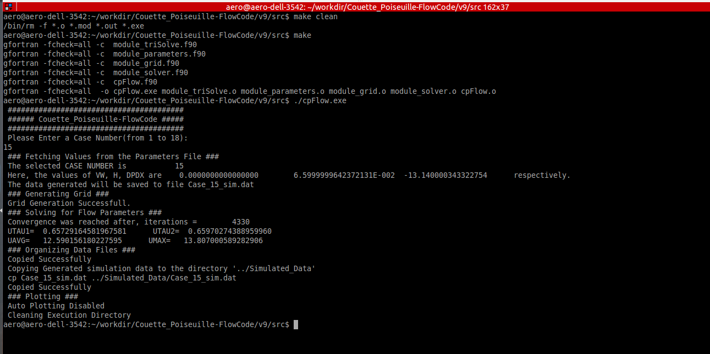

# Couette-Poiseuille Flow Code

<p> The work on computations of Couette-Poiseuille flow with a mixing-length model was done as of part of `Turbulence Practices` course supervised by [Dr. Jean-Philippe Laval](http://imp-turbulence.ec-lille.fr/Webpage/Laval/) during the  coursework of Master's Program in Turbulence. The objective of this course was to program a simple turbulent model in a simple case and to compare the results with the theoretical solution in laminar case, and with experimental results for the turbulent case. As the case was simple, the effect of several parameters such as the number of grid point as well as the grid stretching near the wall were investigated. The attached report contains the details of the case investigated, the governing equations, the details of computation code as well as discussions on the results obtained.
</p>

## Directory Structure:
```sh
cpFlow
├── README.md
├── src
│   ├── autoplotting.py
│   ├── cpFlow.f90
│   ├── Makefile
│   ├── module_grid.f90
│   ├── module_parameters.f90
│   ├── module_solver.f90
│   └── module_triSolve.f90
│
├── Experimental_Data
│   ├── <Casewise Experimental Data>
│   ├── cleanUp.sh
│   └── Experimental_Data_Backup.zip
│
├── Generated_Plots
│   ├── <NEW AUTO-PLOTS WOULD COME HERE>
│   └── plots_previousRun
│       └──<Casewise Comparison Plots>
│
└──  Simulated_Data
    ├── <NEW DATA FILES WOULD COME HERE>
    └── dataFiles_previousRun
       └── <Casewise Simulation Data>
```


## Requirements:
1. gfortran 4.8.4+
2. python 2.7 (optional)
3. numpy 2.1.0+ (optional)
4. matplotlib 1.13.1+ (optional)
5. optparse 1.5.3+ (optional)


## Build:
1. Extract "cpFlow.tar"
2. Please do not modify the directory structure
3. Navigate to "src"
4. Build with "make"
5. Use "make clean" to clean previous build, if required

## Execution
1. After successfull build, execute "./cpFlow.exe"
2. Navigate to "../Simulated_Data" directory to check the generated data.
3. If auto-plotting was enabled, the plot can be found by navigating to "../Generated_Plots" directory.
        

## Notes:
1. To enable auto-plotting(from parameters.f90), python 2.7 with the mentioned libraries are required
2. "cleanUp.sh" in the Experimental Data directory is a script to rename the original data files and make it python-friendly

## Example Output:
```sh
 ########################################
 ###### Couette_Poiseuille-FlowCode #####
 ########################################
 Please Enter a Case Number(from 1 to 18): 15
 ### Fetching Values from the Parameters File ###
 The selected CASE NUMBER is           15
 Here, the values of VW, H, DPDX are    0.0000000000000000        6.5999999642372131E-002  -13.140000343322754      respectively.
 The data generated will be saved to file Case_15_sim.dat
 ### Generating Grid ###
 Grid Generation Successfull.
 ### Solving for Flow Parameters ###
 Total Number Iterations =        4330
 UTAU1=  0.65729164581967581      UTAU2=  0.65970274388959960
 UAVG=   12.590156180227595      UMAX=   13.807000589282906
 ### Organizing Data Files ###
 Copied Successfully 
 Copying Generated simulation data to the directory '../Simulated_Data'
 cp Case_15_sim.dat ../Simulated_Data/Case_15_sim.dat
 Copied Successfully 
 ### Plotting ###
 Creating Plots
 python autoplotting.py --file Case_15_sim.dat
 Case to be plotted:  Case_15_
 Plotting Case
 Saving Plots
 Cleaning Execution Directory
```
## Screenshot
<p align="center">
  
</p>
       

